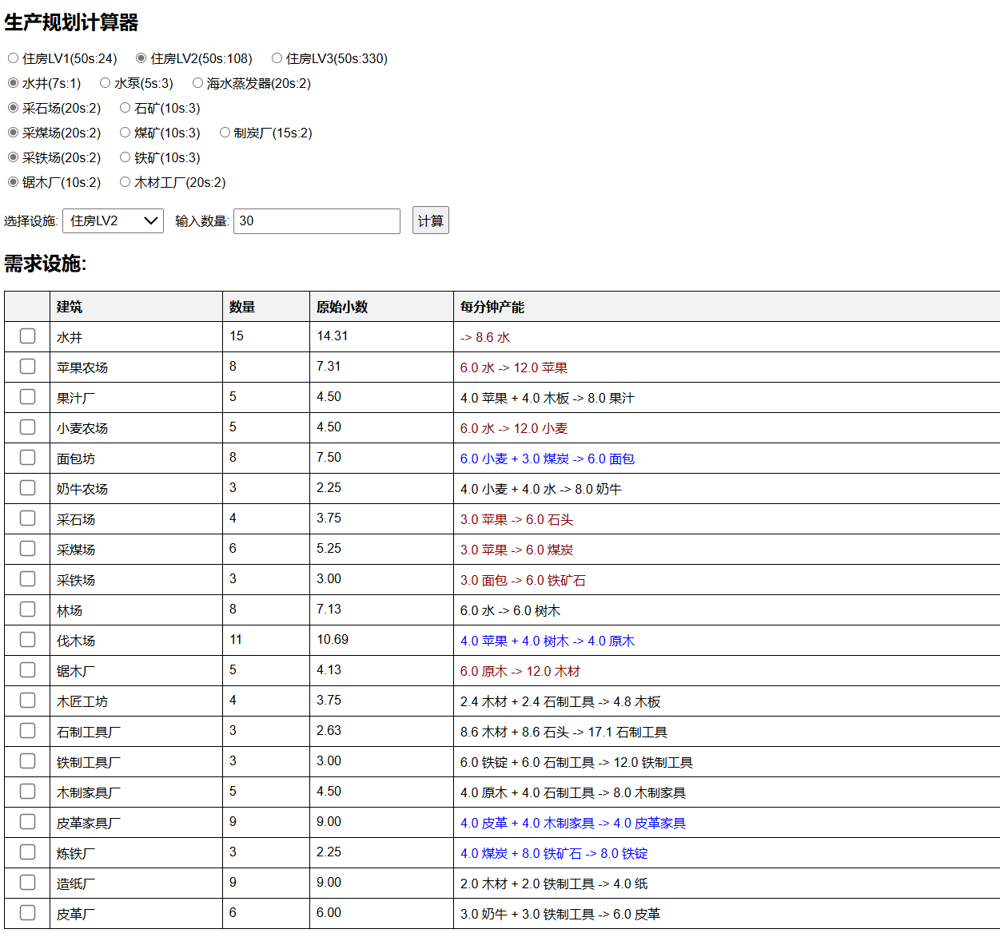

# MiniSettlersCalculater
Mini Settlers 的简易生产计算器

对于有多种产出渠道的材料，需要先选择生产线中使用的建筑种类。
由于计算的目标是根据设施数而非根据材料产量，所以第一行的1级-3级房屋选项其实是可以不用选的。

建筑数量最后会向上取整，但是你需要参照后面的原始小数，自己考虑工作效率未满的农场、水井等设施的情况并决定是否需要追加设施

## 使用
所有代码包括css样式和设施产出列表全部在html文件中，直接用浏览器运行单文件即可。

