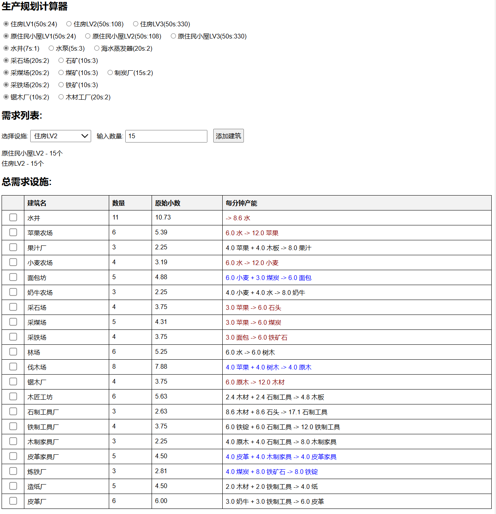

# MiniSettlersCalculater
Mini Settlers 的简易生产计算器

对于有多种产出渠道的材料，需要先选择生产线中使用的建筑种类。
由于计算的目标是根据设施数而非根据材料产量，所以第一行和第二行的1级-3级房屋选项其实是不用选的（选了也没用）。

建筑数量最后会向上取整，但是你需要参照后面的原始小数，自己考虑工作效率未满的农场、水井等设施的情况并决定是否需要追加设施。

## 使用
所有代码包括css样式和设施产出列表全部在单独html文件中，直接下载index.html后用浏览器运行即可。

也可以[直接在线运行](https://htmlpreview.github.io/?https://github.com/Natsukage/MiniSettlersCalculater/blob/main/index.html)

要清除已添加的设施列表，直接刷新网页就行（

勾选的行会淡化显示，用于记录已完成状态

